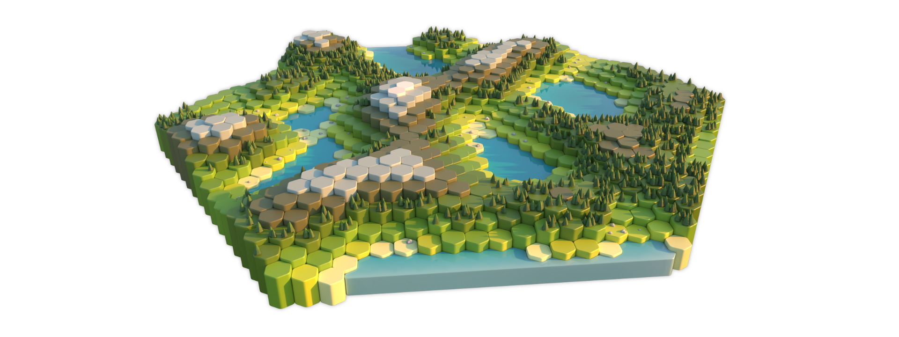

  

# HEXAGONA

**HEXAGONA** is a procedurally generated hexagon-tiled board.

It is distributed as a single Houdini Digital Asset (HDA) and developed as a
long-term, evolving project.

  

---

## Features

- Hexagonal, tile-based procedural board and terrain system
- Board-driven layout with per-tile variation
- Art-directable landscape, sea, and color workflows
- Integrated foliage and rock scattering
- Support for user-supplied maps, meshes, and colors
- Houdini Engine compatible

---

## Installation

### Option 1: Install via Houdini
1. Open Houdini
2. Go to **Assets ▸ Install Asset Library**
3. Select the `HEXAGONA.hda` file on 
4. Click the **Install and Create** or **Install** button

### Option 2: Manual installation
1. Place the `HEXAGONA.hda` file in a directory included in your Houdini OTL path  
   (e.g. `$HOUDINI_USER_PREF_DIR/otls`)
2. Restart Houdini or reload OTLs

---

## Usage

Create a new Geometry node and, inside the Geometry network, place **HEXAGONA** from the TAB menu.

Refer to the release notes for version-specific workflows and changes.

---

## Versioning

HEXAGONA follows **Semantic Versioning** (`MAJOR.MINOR.PATCH`).

Breaking changes are introduced only in major releases.

## Changelog & Release Notes

- **Changelog:** [`CHANGELOG.md`](CHANGELOG.md)
- **Detailed release notes:** [`release-notes/`](release-notes)

## License

Released under the **MIT License**.  
See [`LICENSE`](LICENSE) for details.
